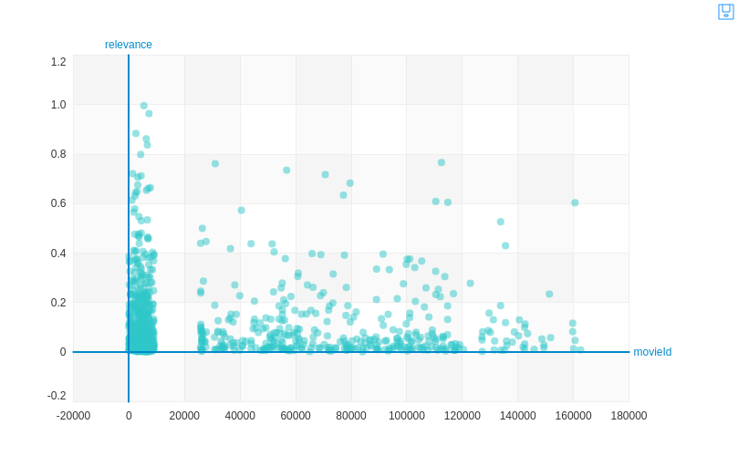

<div style="margin: auto; width: 67%; padding: 10px">
  <table>
    <caption align="bottom">This Project uses <a href="https://turi.com/">Turi, FKA Graphlab</a></caption>
  </table>
</div

---

## Netflix built it's empire with recommender systems

Below is the Jupyter Notebook rendered as *.md*
It uses a data set comprised of about 24 Million actual movie ratings.

I wrote this lab report for a Data Mining Class to explore the use of recommender systems.
The results focus on customization of features.
---

This notebook demonstrates the power of data science for analyzing real-time wifi locations
You can download it on github here:

<a href="https://github.com/majickdave/graphlab_movies"><i class="fa fa-github"> Download Me</i></a>


***

## Recommender Systems
#### David Samuel

Acknowledgement and use of the dataset in publications, is cited below:

MovieLens: http://grouplens.org/datasets/movielens/
-Thanks to Rich Davies for generating the data set.

F. Maxwell Harper and Joseph A. Konstan. 2015. The MovieLens Datasets: History and Context. ACM Transactions on Interactive Intelligent Systems (TiiS) 5, 4, Article 19 (December 2015), 19 pages. DOI=http://dx.doi.org/10.1145/2827872

Graphlab: https://turi.com/learn/userguide/recommender/choosing-a-model.html

The dataset is available here: http://grouplens.org/datasets/movielens/latest/

<a id="top"></a>
### Table of Contents
________________________________________________________________________________________________________

#### I.  Business Understanding
* <a href="#business_understanding">Business Understanding</a>

#### II. Data Understanding
* <a href="#data_understanding">Data Understanding</a>

#### III. Modeling and Evaluation
* <a href="#modeling_and_evaluation">Modeling and Evaluation</a>
* <a href="#Collaborative_Filtering">Final Dataset Description</a>

#### IV.  Deployment
* <a href="#deployment">Deployment</a>

<a id="business_understanding"></a>
<a href="#top">Back to Top</a>
## Business Understanding
• [10 points] Describe the purpose of the data set you selected (i.e., why was this data
collected in the first place?). How will you measure the effectiveness of a goodalgorithm? Why does your chosen validation method make sense for this specific
dataset and the stakeholders needs?

The dataset selected was the Movielens latest dataset.  It consists of a ratings file of over 24 million ratings for 40,000 movie titles. a tags file with over 668,000 tag applications created by just under 26,000 users. The data was collected build and maintain a recommender engine for a movie-user-ratings database Movielens.  The project enables users to tune their own matching algorithm to their needs by rating movies.  

Good algorithms will be measured by precision and recall trade-off.  For a movie recommender like Netflix, the stakeholder might be the user, as they determine how good the recommended movie is, and will likely use the service more if they recieve more precise recommendations. So precision is the focus for most movie recommendations as the user usually only checks the top 5 or so.  Precision governs the completeness of the recommendations, so perhaps a seasoned user may be scrolling towards the next 10 or 20 recommendations looking for a movie.  

<a id='data_understanding'></a>
<a href="#top">Back to Top</a>
## Data Understanding (20 points total)
• [10 points] Describe the meaning and type of data (scale, values, etc.) for each
attribute in the data file. Verify data quality: Are there missing values? Duplicate data?
Outliers? Are those mistakes? How do you deal with these problems?

The data is of very high quality and is not missing any values as will be seen in the SFrame tables and visualizations below.  Luckily, this data set is not sparse, and is huge.  Which will enable customized recommendation engines to be implemented.


```python
import graphlab as gl
ratings = gl.SFrame.read_csv("ml-latest/ratings.csv", header=True)
ratings.head()
```


```python
## import the rest of the data

genome_scores = gl.SFrame.read_csv("ml-latest/genome-scores.csv", header=True, verbose=False)
genome_tags = gl.SFrame.read_csv("ml-latest/genome-tags.csv", header=True, verbose=False)
links = gl.SFrame.read_csv("ml-latest/links.csv", header=True, verbose=False)
movies = gl.SFrame.read_csv("ml-latest/movies.csv", header=True)
tags = gl.SFrame.read_csv("ml-latest/tags.csv", header=True, verbose=False)
```

• [10 points] Visualize the any important attributes appropriately. Important: Provide an
interpretation for any charts or graphs.


```python
gl.canvas.set_target('browser') ## set viz target browser or ipynb
```


```python
ratings = gl.load_sframe('ratings')
gl.canvas.set_target('ipynb')
ratings.show()
```

## As we can see there are no missing values in the num_undefined columns for any of the ratings dataset. Also, the distribution of ratings appears normal with some outliers on the bottom.

### Nearly 40,000 movies are rated from 0.5 to 5 by approximately 260,000 unique users



## The plot above shows the genome tag set with relevance by movie_id highly concentrated in the lower number ids

## The Genomes tag set shows 1,127 unique tag ids corresponding to the genome tagging system


```python
gl.canvas.set_target('ipynb')
genome_scores.show()
```

## The Genomes score set shows 10,668 movies tagged relevant 3,997 times with 1,121 unique tag ids corresponding to the genome tagging system

## reference database for IMDB, and tmdb,
as noted in the author's description there was some descrepancy amongst ids for movies across movie databases.  This will not affect my analysis of the ratings.


```python
movies.show()
```

## Drama is the dominant genre with over 15% of the share.  Over 5% have no genre label at all

## 1,514 unique genres have been identified, with a small descrepancy on movie title and movie id, which is due to the estimated repeated titles of sequels.

Drama was


```python
tags.show()
```

## 17,110 movie reviewers tagged 23,849 different movies 49,627 times using 16 unique tags

<a id='modeling_and_evaluation'></a>
<a href="#top">Back to Top</a>
## Modeling and Evaluation (50 points total)
Different tasks will require different evaluation methods. Be as thorough as possible when analyzing
the data you have chosen and use visualizations of the results to explain the performance and
expected outcomes whenever possible. Guide the reader through your analysis with plenty of
discussion of the results.

<a id="Collaborative_Filtering"></a>
<a href="#top">Back to Top</a>
## Collaborative Filtering
• Create user-item matrices or item-item matrices using collaborative filtering


```python
import graphlab as gl
ratings = gl.SFrame.read_csv("data/ratings.csv", header=True)
ratings.head()
```

## 24 Million ratings


```python
training_data, validation_data = gl.recommender.util.random_split_by_user(ratings, 'userId', 'movieId')
```


```python
training_data.save('training'); validation_data.save('validation')
```


```python
print 'training size:', training_data.shape[0], 'validation size:', validation_data.shape[0]
```

### Determine performance of the recommendations using different performance measures
### and explain what each measure does.

Model performance will be measured by the MSE of predicted rating == objective value, step-size indicates the SDG mini batch sizes.

Precision is the percent relevency of the selected recommendations, and recall is the percent of selected relevent reccomendations
Precision is the focus for most movie recommendations as the user usually only checks the top 5 or so.  Precision governs the completeness of the recommendations, so perhaps a seasoned user may be scrolling towards the next 10 or 20 recommendations looking for a movie.

Because this dataset is based on user rankings to inform the movie recommendation engine, the ranking factorization
will be utilized, but will also be compared to the default Turi factorization recommender.  


```python
m1 = gl.recommender.create(training_data, user_id="userId", item_id="movieId", target="rating")
```


```python
m1.save('model1')
```

## Model 1 has no parameter optimization changes


```python
r1 = m1.recommend(users=[1], k=10, verbose=False)
```


```python
m2 = gl.ranking_factorization_recommender.create(training_data,
                                          user_id='userId',
                                                      item_id='movieId',
                                                      target='rating', verbose=True)
```


```python
m2.save('model2')
```


```python
r = m2.recommend(users=[1], k=10)
```


```python
r.save('results2')
```

## Now try with half the number of factors to reduce overfitting, and lower ranking regularization to increase diversity, and lower sdg_step_size to increase accuracy.


```python
## graphlab.recommender.factorization_recommender.create(observation_data,
##                                                       user_id='user_id', item_id='item_id',
##                                                       target=None, user_data=None, item_data=None,
##                                                       num_factors=8, regularization=1e-08, linear_regularization=1e-10,
##                                                       side_data_factorization=True, nmf=False, binary_target=False, max_iterations=50,
##                                                       sgd_step_size=0, random_seed=0, solver='auto', verbose=True, **kwargs)


m3 = gl.recommender.ranking_factorization_recommender.create(training_data, user_id="userId", item_id="movieId", target="rating",
                           num_factors=16, ranking_regularization=0.1, sgd_step_size=0.025)
```

## The adjustments lowered the final objective value and the overall RMSE


```python
m3.save('model3')
```

## Now with this recommender, i will add tags as new data to the model with diversity=1 to spice up the list, and k=15 to explore the possible recall


```python
## FactorizationRecommender.recommend(users=None, k=10,
##                                    exclude=None, items=None,
##                                    new_observation_data=None,
##                                    new_user_data=None, new_item_data=None,
##                                    exclude_known=True, diversity=0, random_seed=None, verbose=True)
r3 = m3.recommend(users=[1], new_user_data=tags, diversity=1, k=15).print_rows(num_rows=15)
```


```python
r3.save('rec3')
```

## Changed item_data to include genome scores of the movies, and lower step further to 0.15, increase to max iterations


```python
m4 = gl.recommender.factorization_recommender.create(training_data,
                                                      user_id='userId', item_id='movieId',
                                                      target='rating', user_data=None, item_data=genome_scores,
                                                      num_factors=32, regularization=1e-08, linear_regularization=1e-10,
                                                      side_data_factorization=False, nmf=False, binary_target=False, max_iterations=50,
                                                      sgd_step_size=0.15, random_seed=0, solver='auto', verbose=True)
```


```python
m4.save('model4')
```

## Try diversity 2 now


```python
## FactorizationRecommender.recommend(users=None, k=10,
##                                    exclude=None, items=None,
##                                    new_observation_data=None,
##                                    new_user_data=None, new_item_data=None,
##                                    exclude_known=True, diversity=0, random_seed=None, verbose=True)
r4 = m4.recommend(users=[20000], diversity=2, k=10)
r4
```


```python
for mo in r4['movieId']:
    print movies[mo]
```


```python
r2 = m2.recommend(users=[20000], diversity=2, k=10)
r2
```


```python
movies[r2[movieId]]=5928
## for mo in r2['movieId']:
##     movies[mo]
```


```python
r1 = m1.recommend(users=[20000], diversity=2, k=10)
```


```python
for mo in r1['movieId']:
    print movies[mo]
```


```python
m3.recommend(users=[20000], diversity=2, k=15).print_rows(num_rows=15)
```

• Use tables/visualization to discuss the found results. Explain each visualization in detail.


```python
import graphlab as gl

m1 = gl.load_model('model1')
m2 = gl.load_model('model2')
m3 = gl.load_model('model3')
m4 = gl.load_model('model4')
m5 = gl.load_model('model5')
m6 = gl.load_model('model6')
m7 = gl.load_model('model7')

```


```python
validation_data = gl.load_sframe('validation')

gl.canvas.set_target('ipynb')
model_comp = gl.compare(validation_data, [m1, m2, m3, m4, m5, m6, m7], verbose=False)
gl.show_comparison(model_comp, [m1, m2, m3, m4, m5, m6, m7])
```

## Lowering ranking regularization, and halving the number of factors greatly reduced precision and recall of m3, m1 however has a higher cutoff for recall than precision as m1 compares to m2.  It appears that adding the ranking factorization in models 4 through 7 destroyed the models ability to recover precision and recall.  Models 1, 2 and 3 performed the best with


```python
r2 = m2.recommend(users=[1], k=10, verbose=True)
r2
```


```python
r3 = m3.recommend(users=[1], k=10, verbose=True)
r3
```

## Both methods pull identical top 3 movie recommendations, as well as many other repeats, but perhaps this is just how user 1 chose his movies ranks


```python
r1 = m1.recommend(users=[1], k=10, verbose=True)
r1
```


```python
m5 = gl.recommender.factorization_recommender.create(training_data,
                                                      user_id='userId', item_id='movieId',
                                                      target='rating', user_data=None, item_data=movies,
                                                      num_factors=32, regularization=1e-08, linear_regularization=1e-10,
                                                      side_data_factorization=False, nmf=False, binary_target=False, max_iterations=25,
                                                      random_seed=0, solver='auto', verbose=True)
```


```python
m5.save('model5')
```


```python
m6 = gl.recommender.factorization_recommender.create(training_data,
                                                      user_id='userId', item_id='movieId',
                                                      target='rating', user_data=None, item_data=movies,
                                                      num_factors=32, regularization=1e-08, linear_regularization=1e-10,
                                                      side_data_factorization=False, nmf=False, binary_target=False, max_iterations=25,
                                                      random_seed=0, solver='auto', verbose=True)
```


```python
m6.save('model6')
```


```python
m6 = gl.recommender.factorization_recommender.create(training_data,
                                                      user_id='userId', item_id='movieId',
                                                      target='rating', user_data=None, item_data=movies,
                                                      num_factors=32, regularization=1e-08, linear_regularization=1e-10,
                                                      side_data_factorization=False, nmf=False, binary_target=False, max_iterations=25,
                                                      random_seed=0, solver='sgd', verbose=True)
```


```python
m6.save('model6')
```


```python
m7 = gl.recommender.factorization_recommender.create(training_data,
                                                      user_id='userId', item_id='movieId',
                                                      target='rating', user_data=None, item_data=None,
                                                      num_factors=32, regularization=1e-08, linear_regularization=1e-10,
                                                      side_data_factorization=False, nmf=False, binary_target=False, max_iterations=25,
                                                      random_seed=0, solver='sgd', verbose=True)
```


```python
m7.save('model7')
```

## Describe your results. What findings are the most compelling and why?

It is very interesting that when I changed item_data to include genome scores of the movies, and lower step and increased max iterations, the precision and recal shot way down so it had either very low precision and high recall, or very low recall and high precision.  Movie recommendations are interesting though becuase you don't walways want to be so precise and overfit the recommendations by only having the same "relevant" movies while decent obscure movies lay around without many ratings or tags.

* <a href="#deployment">Deployment</a>
<a href="#top">Back to Top</a>
## Deployment


## Be critical of your performance and tell the reader how you current model might be usable by other parties. Did you achieve your goals? If not, can you reign in the utility of your modeling?

The methodologies for this lab have not been streamlined for commercial use, however to work with a dataset of over 24 million ratings and get a recommender system that is fairly good especially when it comes to precision/recall, it is remarkable.

I achieved my goals of tuning the recommender to achiever softer recommendations, as was mentioned on the movielens website.  This seems to be an inherent problem with recommender systems, a lack of tuning, and a lack of data.  

## How useful is your model for interested parties (i.e., the companies or organizations that might want to use it)?

The utility of implmenting custom tailored recommender engines is very far reaching, and movie databases and ratings are ever expanding with Netflix, Amazon, and other streaming services collecting and applying data to machine learning models.


 ## How would your deploy your model for interested parties?

 I would use Amazon EC2 to run models on various settings for each user to build a recommendation profile for old users, and then use that metadata to tune the recommendation engines of new users.


## What other data should be collected?

More movie metadata like actors, budget, facebook likes, movie release data. Perhaps some additional survey information like inputing your top 10 favorite movies.

## How often would the model need to be updated, etc.?

It would be wise to maintain a recommendation for a someones top 10 then update model everytime user logs in and clicks on a movie, and ofter new chances to change your all time top 10.
