# This Notebook explores the mysterious, NIST handwritten digits dataset


<div style="text-align: center;">
  <small > This Project uses   <a href="https://scikit-learn.org/stable/">SK-Learn</a>, a python module </small>
</div>

Tensorflow, Google's deep learning framework, is built on work done in sklearn and opencv

Below is the Jupyter Notebook rendered as *.md*
It uses a data set comprised of about 24 Million actual movie ratings.

I wrote this lab report for a Data Mining Class to explore the use of recommender systems.
The results focus on customization of features.
---

This notebook demonstrates the power of data science for analyzing real-time wifi locations
You can download it on github here:

<a href="https://github.com/majickdave/NIST_digits"><i class="fa fa-github"> Download Me</i></a>

***


## Here's a sample of the digits from Kaggle:


<a id='class_distribution'></a>
<a href="#top">Back to Top</a>
### Class Distribution
The below graph shows the frequency of digits that occured in the data set.


```python
# http://seaborn.pydata.org/generated/seaborn.set.html?highlight=seaborn.set#seaborn.set

# seaborn.set(context='notebook', style='darkgrid', palette='deep', font='sans-serif', font_scale=1, color_codes=False, rc=None)
import matplotlib.pyplot as plt
import seaborn as sns       # import the seaborn library for a quick distribution plot
sns.set(color_codes=True)       # Reset color_codes to default

print 'Size of the training dataset:', dataset.shape[0], 'Rows and', dataset.shape[1], 'Columns'  #shape[0,1] = row, col
print 'Size of the testing dataset:', test.shape[0], 'Rows and', test.shape[1], 'Columns'
print 'Number of unique classes:', len(dataset.label.unique())
labels = sorted(dataset.label.unique())                              #sort unique labels
print 'The Classes:', labels
sns.set(style='darkgrid', palette='pastel')       # Set grid style and color palette of seaborn object
c = pd.Series(target)                             # Create a series of the target labels
c = c.value_counts()                              # Set value_counts for the classes
sns = c.plot(title="Digit Frequency", kind='barh')  # set seaborn object equal to Series.plot object and it will plot automatically
plt.show()                                        # Show plot cleanly

```

    Size of the training dataset: 42000 Rows and 785 Columns
    Size of the testing dataset: 28000 Rows and 784 Columns
    Number of unique classes: 10
    The Classes: [0, 1, 2, 3, 4, 5, 6, 7, 8, 9]


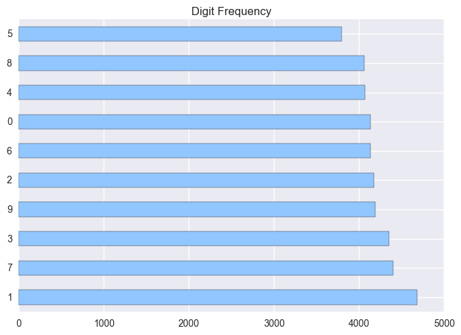


The plot above shows the distribution of the labeled classes in the training Set.
We can see from the graph above that the most common digit is 1 and occurs just under 5000 times. this will be taken into account in later sections.

<a id='data_preparation'></a>
<a href="#top">Back to Top</a>
# III. Data Preparation

## Split the data into training and testing and show the distribution of the split
Now the data set must be split in order to help determine how the distribution would correlate to the cross validation test. the grap below shows the output.

We will use train_test_split to partition the data 50/50 and stratified kfolds for cross validation as this was observed as the most common methodology for this competition.


```python
import matplotlib.pyplot as plt
import matplotlib.cm as cm

# convert to array, specify data type, and reshape
targets = target.astype(np.uint8)
trains = np.array(train).reshape((-1, 1, 28, 28)).astype(np.uint8)
tests = np.array(test).reshape((-1, 1, 28, 28)).astype(np.uint8)

plt.imshow(trains[1729][0], cmap=cm.binary) # draw the picture

plt.show()
```


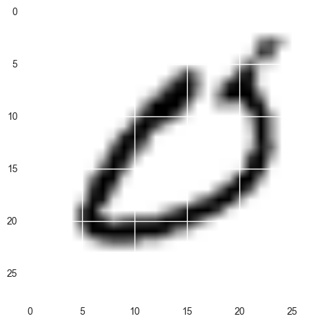


# Below we plot the various number plots in order to show what the images actually look like.


```python
%matplotlib inline
# The function below plots the images with their labels above
# Code sampled from ../03.%20Dimension%20Reduction.ipynb

import matplotlib.pyplot as plt    #import pylab library which is suited for plotting images

# Set X and y to plot
X = train
y = target
names = np.sort(dataset.label.unique())     # Created sorted labels array to match titles with images
done = set()                                # Create and empty set of explored indices

#  Create function to plot single digit of interest
def plot_now(images, h=28, w=28, cmap=plt.cm.binary, indx=True, r=0):    # Set default constructor values  
    plt.imshow(images.reshape((h, w)), cmap=cmap)                        # Reshape images and set cmap color
    if indx==True:
        plt.xlabel('index: '+str(r), size=12)                  # Option to show index
        plt.title(names[y][r], size=16)                                      # Sets title from sorted names [y] and index [r]
    plt.xticks(())                              # Eliminate tick marks
    plt.yticks(())

#  Create function to plot a gallery of interest
def plot_gallery(images, titles,  h=28, w=28, n_row=3, x=1.7, y=2.3, n_col=6,
                 cmap=plt.cm.binary, random=True, indx=True, r=0, size=16):  
    # Optional row and size parameters will allow us to reuse code, set random to false and r to an index of your choice
    # to see a continous gallery

    plt.figure(figsize=(x * n_col, y * n_row))                          # Set figure size as a ratio of rows
    plt.subplots_adjust(bottom=0, left=.01, right=.99, top=.90, hspace=.35) # Adjust spacing of subplots
    for i in range(n_row * n_col):                                         # Adjust spacing of subplots
        move=True                  # logical to move on if a random int is found not in the done set()                                       
        while random and move:      
            r=(np.random.randint(len(images)-(n_row*n_col)-1))          # Create a random integer no greater than the size of the set, and gallery
            if r not in done:                                        # if integer has not been used
                done.add(r+i)                                       # add to set
            move=False          # Optional randomization to explore sets
        plt.subplot(n_row, n_col, i + 1)                        # create subplot for each
        plt.imshow(images[i+r].reshape((h, w)), cmap=cmap)      # plot images reshaped to 28*28
        if indx==True:plt.xlabel('index: '+str(i+r), size=12)   # print index if True
        plt.title(titles[i+r], size=size)                       # print label
        plt.xticks(())
        plt.yticks(())   # remove ticks


```

### Using the plot_gallery()  function we can now plot a random gallery, or an individual image or array of images plot_now() function will plot a single digit.


# Take a look at the colormapping guide

http://matplotlib.org/users/colormaps.html

# The cmap, cool color scheme more clearly defines the centers and edges of the shapes, as well as blobs.
Now that the pictures are more obvious with a more distinguishable color scale it can be dertemined that the centers and edges are more well defined


```python
plot_gallery(X, names[y], 28, 28, indx=True, random=True, cmap=plt.cm.cool)
```


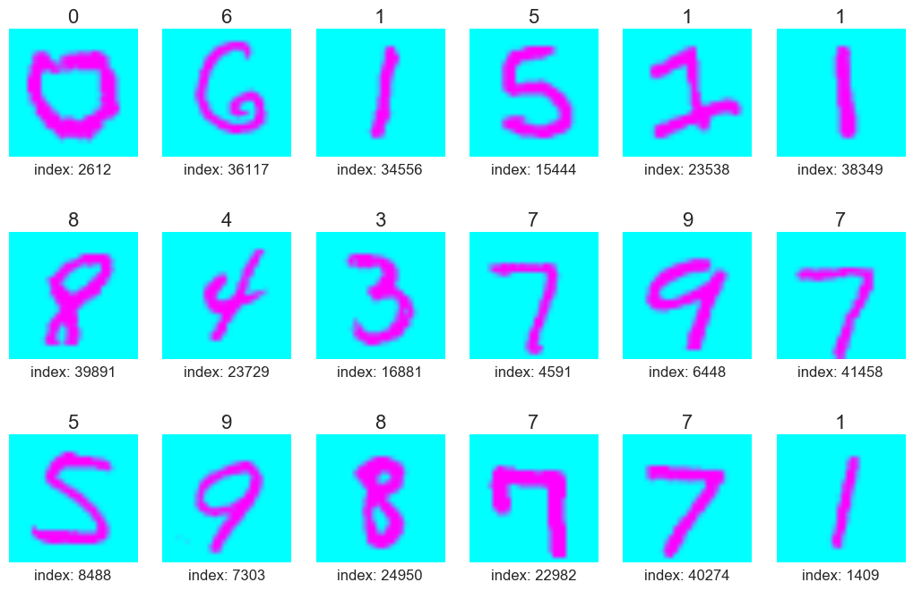


# Pick out an image that looks weird  and plot it below

Inferno cmap has been able to show some weird features


```python
N=17972
plot_now(X[17972], cmap=plt.cm.inferno, indx=False)
```


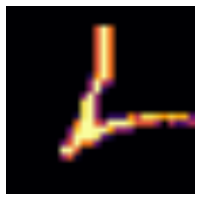


# Using a mask we can reduce the dimensionality of the data


```python
# mask the black pixels
black = np.ma.masked_where(X <= 230, X)

# black = black.compressed()
# blacks = black.reshape(42000, 784).astype(np.uint8).ravel()
```

# Now take a closer look at an image of interest recreated from the mask to match the original color.  All that is left is a skelaton of the actual writing.

Perhaps these images could be reprocessed into shape data to be trained with


```python

plot_now(X[N], cmap=plt.cm.gray, indx=False, r=N)
```


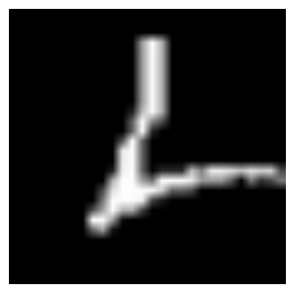


```python
weird = set()  # empty set of strange images
N=17972       #
plot_now(black[N], cmap=plt.cm.binary, indx=False, r=N)
plt.savefig('img/'+str(N)+'.png', transparent=True, bbox_inches='tight', pad_inches=-0.15) # Save image
```


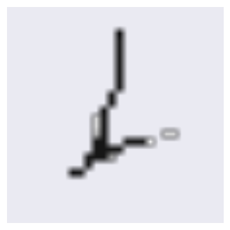


# Compared with the original, this digit has become more recognizeable through the masking, at least in making its most distinguishing feature more pronounced.


```python
plot_gallery(black, names[y],  h=28, w=28, n_row=3, x=1.7, y=2.3, n_col=6,
                 cmap=plt.cm.binary, random=True, indx=True, r=0, size=16)
```


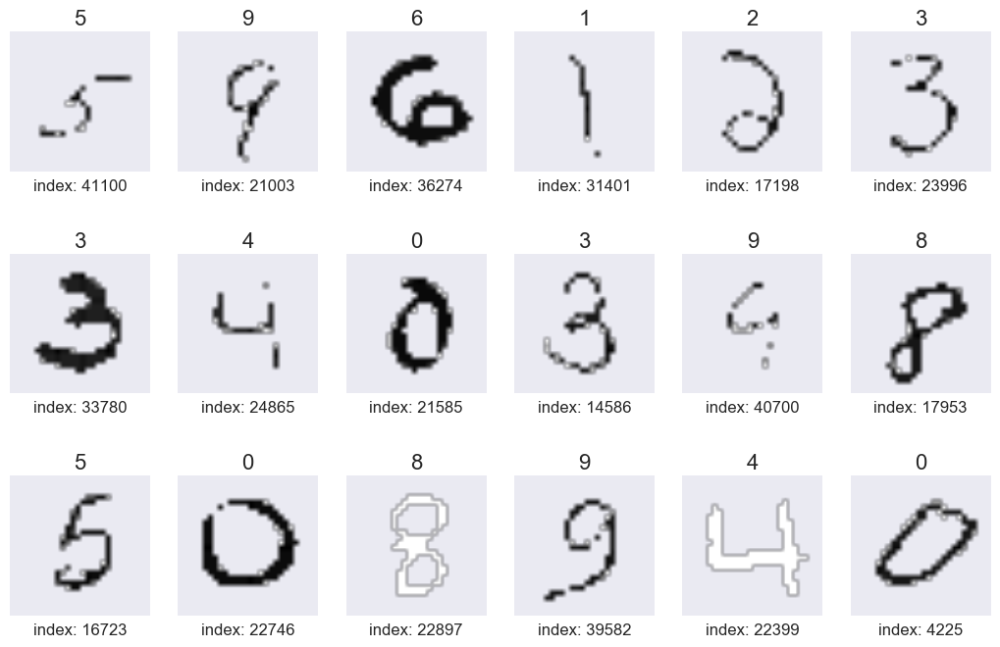


# Above are random images recreated from the mask at levels of black above 230, as you can see the images have become very simplified, in some cases, over-lossy, but could provide a better training set for the neural nets.

<a id='final_dataset_description'></a>
<a href="#top">Back to Top</a>

# Final Dataset Description:

We will use a combination of transformed datasets, including the original training and testing sets, the train_test_split sets used in cross-validation, and the PCA transformed dataset which will create n=50 variables.


<a id='modeling_and_evaluation'></a>
<a href="#top">Back to Top</a>
# IV.  Modeling and Evaluation

The next necessary function for this data set is to determine which of the components are most important. To do this a PCA is performed.

 We will then use a variety of classification techniques, report on their accuracy, modify the parameters, and iterate this process until we find a stable, reproducable method that achieves high accuracy with relatively low training times.

 We will use a logistic regression classifier with cross validation using 2 different models, and compare the accuracies, and plot a confusion matrix.
 We will also train a support vector machine classifier with a 4 different kernels and compare accuracy of each.
 In addition, both a ball_tree and kd_tree classifier will be used and accuracy reported.

 Finally, a random forest classifier will be used as a benchmark for future neural nets to be run.

## 1) Evaluation Metrics

Cross validation of the training set will be used to measure the predictive power of each model. For the purpose of digit classification, we will use sklearn's metrics library to score each classification as either true or false.  We will also use a confusion matrix function to identify classes that are being incorrectly predicted.  The goal is 100% percent accuracy in prediction of all digit classes (or reduce the total number of false predictions generated from the model), therefore precision, and other metrics will not be used in this analysis.


```python
# Code adapted from
# http://scikit-learn.org/stable/_downloads/plot_confusion_matrix.py


from datetime import datetime as dt; start = dt.now()
print(__doc__)

import itertools
import numpy as np
import matplotlib.pyplot as plt
from sklearn import svm, datasets
from sklearn.metrics import confusion_matrix

# Create confusion matrix function to plot errors in predictions
def plot_confusion_matrix(cm, classes,
                          normalize=False,
                          title='Confusion matrix',
                          cmap=plt.cm.Blues):
    """
    This function prints and plots the confusion matrix.
    Normalization can be applied by setting `normalize=True`.
    """
    plt.imshow(cm, interpolation='nearest', cmap=cmap)
    plt.title(title)
    plt.colorbar()
    tick_marks = np.arange(len(classes))
    plt.xticks(tick_marks, classes, rotation=45)
    plt.yticks(tick_marks, classes)

    if normalize:
        cm = cm.astype('float') / cm.sum(axis=1)[:, np.newaxis]
        print("Normalized confusion matrix")
    else:
        print('Confusion matrix, without normalization')

    print(cm)

    thresh = cm.max() / 2.
    for i, j in itertools.product(range(cm.shape[0]), range(cm.shape[1])):
        plt.text(j, i, cm[i, j],
                 horizontalalignment="center",
                 color="white" if cm[i, j] > thresh else "black")

    plt.tight_layout()
    plt.ylabel('True label')
    plt.xlabel('Predicted label')

```

    Automatically created module for IPython interactive environment


## 2) Dividing the data


```python
import pandas as pd
from sklearn.model_selection import train_test_split  
# We will try the method train_test_split instead of ShuffleSplit because it was suggested by a number of Kagglers

print("Importing...")
# create data frame of training and testing sets
train = pd.read_csv("https://dl.dropboxusercontent.com/s/xb2xkaiwxelx55g/train.csv?raw=1")
y = train[[0]].values.ravel()                  # Set y equal to label values, ravel strips extra dimensional array
X = train.iloc[:,1:].values                    # Set X equal to pixels

print("splitting...")                          # distribute 4 sets
X_train, X_test, y_train, y_test = train_test_split(X,
                    y, test_size=0.5)  # create X and y training and testing sets

# Use a 50/50 split with a stratified kfold
print("Done!")

```

     Importing...
    splitting...
    Done!


## Stratified k-fold cross-validation
will be used for the Support vector machine and logistic regression models to avoid over-fitting by stratifying the resampling across 10 folds, each of the 10 classes should be able to be captured evenly.


```python
# Used guidance per Kaggle, Data Mining Lectures, and Sklearn documentation
# http://scikit-learn.org/stable/modules/generated/sklearn.model_selection.StratifiedKFold.html

from sklearn.model_selection import StratifiedKFold
skf = StratifiedKFold(n_splits=10, shuffle=True, random_state=None)

# Choose 10 splits with shuffling to thoroughly randomize the training cases
```

# Classification Task 1

classify the digits in the training set

## Model 1 - Logistic regression


```python
# Let's try reducing dimensionality with PCA to 50 components
# as we have seen from the eigenvectors from lab 1, 50 should be sufficient
# http://scikit-learn.org/stable/modules/generated/sklearn.decomposition.PCA.html#sklearn.decomposition.PCA.fit_transform
# sklearn.decomposition.PCA(n_components=None, copy=True, whiten=False,
# svd_solver='auto', tol=0.0, iterated_power='auto', random_state=None)
from scipy import stats, integrate
import matplotlib.pyplot as plt
import seaborn as sns
sns.set(color_codes=True)
from sklearn.decomposition import PCA

print("Fitting PCA...")
n_comp = 50

# whitening was recommended, as well as arpack solver

pca = PCA(n_components=n_comp, whiten=True, svd_solver='arpack')  # Create PCA object

# Set fitted PCA object
trainer = pca.fit_transform(X_train)  # fit and transform the pca model in one operation
tester = pca.fit_transform(X_test)

print("Done!")
```

    Fitting PCA...
    Done!


```python
 def pca_plot(X, n_comp, svd_solver='auto', cmap=plt.cm.viridis, scaler=1.0):   # create a plotter function for PCA

    plot_gallery(eigendigits, eigendigit_titles, n_row=int(np.floor(np.sqrt(n_comp))),   # set gallery size to number of PCA to scaler
                 n_col=int(np.ceil(np.sqrt(n_comp))), x=(1.7*scaler), y=(2.3*scaler),
                 indx=False, random=False, cmap=cmap, size=(16*scaler))
```


```python
try:
    eigendigits = pca.components_.reshape((n_comp, 28, 28))    # set eigenvalues
    eigendigit_titles = ["eigendigit %d" % i for i in range(eigendigits.shape[0])]  #create the labels
    pca_plot(train, 20, scaler=0.5)
except IndexError:
    pass
```


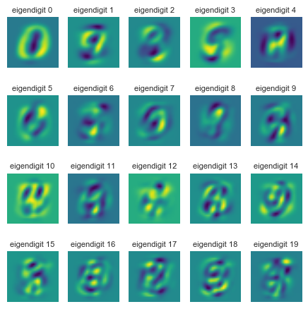


### The plot above shows the first 20 eigendigits

The first 10 eigendigits resemble the following digits: 0, 3, 8, 9
After digit 10 they begin to lose form.
These will be the most important to train accurately.


```python
evr = pca.explained_variance_ratio_         # call evr on the PCA object to get the variance explained by each PC
print round(sum(evr)*100), "Percent Variance Explained by", n_comp, 'PCs'

# Create cumulative series to plot
cum = 0
d = []
evr = pca.explained_variance_ratio_

for i in range(n_comp):  
    cum += evr[i]
    d.append(cum)
```

    83.0 Percent Variance Explained by 50 PCs


From the output output we  can see that the variance is explained by the top 50 principal components, which is a fairly large percentage.


```python
sns.set(style='darkgrid')
plt.plot(d, color='orange', label=True)
plt.title('Cumulative Distribution')
plt.xlabel('PC')
plt.ylabel('percent var explained')
plt.show()
```


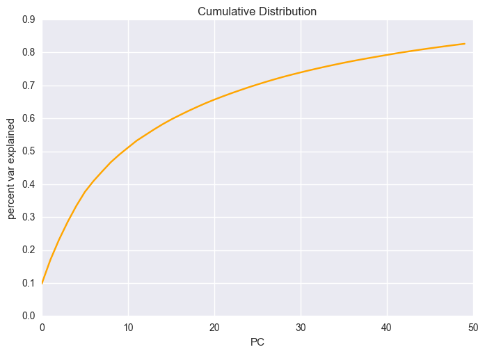


## Plotting the variance
We can see from the distibution chart above that neearly 80% of the variance is explaied by the top 40 and 65% of the variables are explained by the top 20 PCs


```python
# run logistic regression and vary some parameters
from sklearn.linear_model import LogisticRegressionCV
from sklearn import metrics as mt
from datetime import datetime as dt
import multiprocessing

start = dt.now()
# first we create a reusable logisitic regression object
#   here we can setup the object with different learning parameters and constants

c = LogisticRegressionCV(Cs=10,
                              fit_intercept=True, cv=skf,
                              n_jobs=-1, penalty='l2',
                              solver='sag', tol=0.00001,
                              class_weight=None,
                              verbose=0, refit=True,
                              intercept_scaling=1.0, multi_class='multinomial')
print("Sag Solver..."),
print("Fitting Logit..."),
c.fit(trainer, y_train)

print("predicting...")
y_hat = c.predict(tester)

print 'Accuracy is', mt.accuracy_score(y_test,y_hat)*100, '%'

print multiprocessing.cpu_count(), 'CPUs Ran in', dt.now() - start, 'minutes'

conf = mt.confusion_matrix(y_test,y_hat)
plot_confusion_matrix(conf, [x for x in range(10)],
                          normalize=False,
                          title='Confusion matrix',
                          cmap=plt.cm.cool)
```

    Sag Solver... Fitting Logit... predicting...
    Accuracy is 13.8952380952 %
    8 CPUs Ran in 0:01:52.711000 minutes
    Confusion matrix, without normalization
    [[1673    0   20  111   17  135   22   14   23    9]
     [   0    9    8    3  150  338  132 1207   22  489]
     [  78    2  141  625   78   66    2  482  267  344]
     [ 219    9  436   84  600   35  354  208  115  116]
     [  45   73  131  808   26  334  148    2  492   35]
     [ 217   30   86  116  151   91  739  240  116  115]
     [  61    2    0  309  103  906   10   84  286  246]
     [ 118  137 1230  262    4  157   89  132  103   18]
     [  27    5  410   75  210   27  274   58  743  154]
     [  43  160  823  354    7  133  389   10  194    9]]


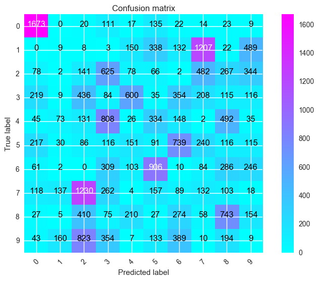


## Model 2 - SVC

Support Vector Machine Classifier with a radial basis function


```python
from sklearn.svm import SVC
from sklearn import metrics as mt

# rbf kernel
start = dt.now()
s = SVC(C=1.0, kernel='rbf', tol=0.00001, cache_size=200, decision_function_shape='ovr')
print("Training SVM..."),
s.fit(trainer, y_train)

print("Predicting...")
y_hat = s.predict(tester)
print 'Accuracy', mt.accuracy_score(y_test,y_hat)*100, '%'

print 'CPU Time: ', dt.now() - start

conf = mt.confusion_matrix(y_test,y_hat)

conf = mt.confusion_matrix(y_test,y_hat)
plot_confusion_matrix(conf, [x for x in range(10)],
                      normalize=False,
                      title='Confusion matrix',
                      cmap=plt.cm.Purples)
```

    Training SVM... Predicting...
    Accuracy 16.3952380952 %
    CPU Time:  0:00:22.678000
    Confusion matrix, without normalization
    [[1598    0   58  103   65   92   46    4   26   32]
     [   1  222   13   24  265  344   41  534   35  879]
     [  29    4  267  659  115   88    1  302  387  233]
     [ 199    8  634   79  551   33  264  166  156   86]
     [  30   11   69  894   44  299   55    4  670   18]
     [ 200    2   96  105  342  119  554  143  196  144]
     [  97    0    2  387  107  829   21   56  336  172]
     [ 113  108 1235  316    3  135   50   97  186    7]
     [  22    0  283  103  250   24  169   33  989  110]
     [  36   93  622  449   20   96  160   19  620    7]]


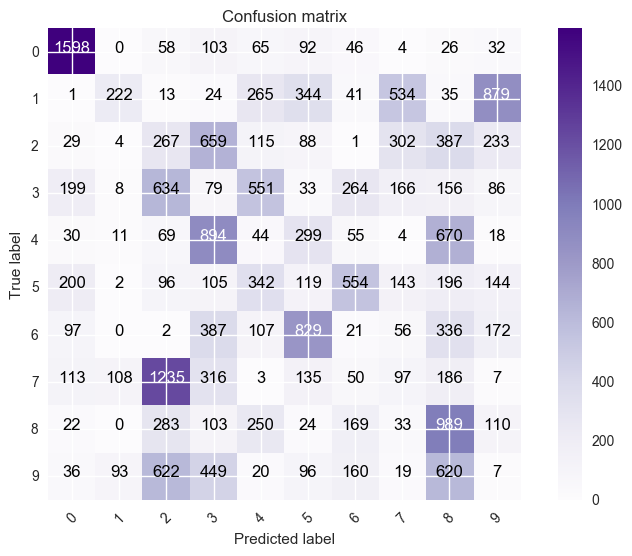


## Model 3 - KNN using a ball tree algorithm


```python
from sklearn.neighbors import KNeighborsClassifier
start = dt.now()

knn = KNeighborsClassifier(n_neighbors=5, algorithm='ball_tree', p=2, n_jobs=-1)  # default is n_neighbors=5, stick with it for training
print 'Fitting', 'ball_tree'
knn.fit(X_train, y_train)
y_hat = knn.predict(X_test)
print 'ball_tree accuracy:', mt.accuracy_score(y_hat,y_test)
print 'CPU Time: ', dt.now() - start

conf1 = mt.confusion_matrix(y_test,y_hat)
plot_confusion_matrix(conf1, [x for x in range(10)],
                  normalize=False,
                  title='Confusion matrix',
                  cmap=plt.cm.PuRd)

```

    Fitting ball_tree
    ball_tree accuracy: 0.959428571429
    CPU Time:  0:02:46.495000
    Confusion matrix, without normalization
    [[2015    0    1    1    0    2    5    0    0    0]
     [   0 2347    3    1    2    0    1    3    0    1]
     [  17   39 1962   10    4    2    3   39    8    1]
     [   6    9   19 2090    0   23    1    9   10    9]
     [   3   30    0    0 1984    0   10    5    0   62]
     [   8    5    1   41    3 1797   29    2    1   14]
     [   8    2    1    0    3    9 1982    0    2    0]
     [   1   36    8    3    7    0    0 2160    0   35]
     [   4   31    6   48   13   50    9    5 1799   18]
     [  10    5    2   24   29    3    1   33    3 2012]]


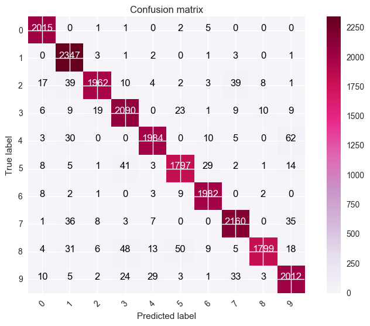


```python
# Create plotter for train_test_split to visualize distributions of multiple sets at once
%matplotlib inline
import numpy as np
import matplotlib.pyplot as plt
import seaborn as sns; sns.set(color_codes=True)            # reset colors

def splitter_display(train, test):                          # split display function
    sns.color_palette("Blues")
    sns.color_palette("husl", 8)
    sns.set_style("whitegrid", {'axes.grid' : False})       # white grid, no lines

    ax = sns.distplot(train, bins=10, hist=True, kde=False)      # class distribution of sets
    ax = sns.distplot(test, bins=10, hist=True, kde=False)
    ax.set(title="Train Set vs. Cross Validation Test Set", xlabel='Digit Class', ylabel='Frequency in Set', xticks=[0, 1, 2, 3, 4, 5, 6, 7, 8, 9])

    plt.show()

splitter_display(y_train, y_test)
```


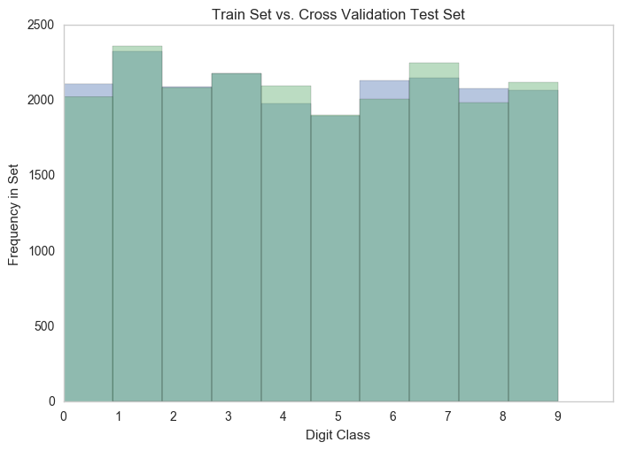


### The Plot above shows differences in frequencies of the split in colored sections.  If the distribution appears normal, then it is ready for testing.

### The frequency of the split looks normal, ie. no noticable difference in color distribution above the bars.  

Note: This may not need to be run each time, as the train_test_split ensures a balanced class distribution


```python
# from the tutorial: http://www.kaggle.com/c/datasciencebowl/details/tutorial

def multiclass_log_loss(y_true, y_pred, eps=1e-15):
    """Multi class version of Logarithmic Loss metric.
    https://www.kaggle.com/wiki/MultiClassLogLoss

    Parameters
    ----------
    y_true : array, shape = [n_samples]
            true class, integers in [0, n_classes - 1)
    y_pred : array, shape = [n_samples, n_classes]

    Returns
    -------
    loss : float
    """
    predictions = np.clip(y_pred, eps, 1 - eps)

    # normalize row sums to 1
    predictions /= predictions.sum(axis=1)[:, np.newaxis]

    actual = np.zeros(y_pred.shape)
    n_samples = actual.shape[0]
    actual[np.arange(n_samples), y_true.astype(int)] = 1
    vectsum = np.sum(actual * np.log(predictions))
    loss = -1.0 / n_samples * vectsum
    return loss
print("multiclass_log_loss() method loaded..")
```

    multiclass_log_loss() method loaded..


From the below graph we can see that the accuracy of this PCA is around .83 which is respectable but not perfect. We can also see that the log loss from this method is about 5.6 and fairly consistent between the 2 tests.


```python
from sklearn.decomposition import PCA
from sklearn.tree import DecisionTreeClassifier
from sklearn import metrics as mt

dt_clf = DecisionTreeClassifier()

print 'Training Once:'
# train the decision tree algorithm
dt_clf.fit(X_train,y_train)
yhat = dt_clf.predict(X_test)
class_probabilities = dt_clf.predict_proba(X_test)

print 'Accuracy:', mt.accuracy_score(y_test,yhat)
print 'Log Loss:', multiclass_log_loss(y_test, class_probabilities)

print 'Training Again:'

# train the decision tree algorithm
dt_clf.fit(trainer,y_train)
yhat = dt_clf.predict(tester)

print 'Accuracy:', mt.accuracy_score(y_test,yhat)
print 'Log Loss:', multiclass_log_loss(y_test, class_probabilities)
```

    Training Once:
    Accuracy: 0.842380952381
    Log Loss: 5.44396904129
    Training Again:
    Accuracy: 0.129523809524
    Log Loss: 5.44396904129


# The results above show that PCA reduce the accuracy of a Decision tree dramatically, so it won't be used for randomforest or any other tree.

<a id='using_pca'></a>
<a href="#top">Back to Top</a>
# Using PCA

From the graph below we do see a higher log loss and lower accuracy when performing this decision tree classifier but that is expected.

For the below it was determined that we should only use the Gini criterion, as entropy is too sensitive for this type of image classification


```python
log_losses = []
accuracies = []
params = []

from matplotlib import pyplot as plt
%matplotlib inline

# how to make it generalize a bit better?
# dt_clf = DecisionTreeClassifier(criterion='gini', splitter='best', max_depth=None, min_samples_split=2,
#  min_samples_leaf=1, min_weight_fraction_leaf=0.0,
#  max_features=None, random_state=None, max_leaf_nodes=None,
#  min_impurity_split=1e-07, class_weight=None, presort=False)
# defaults
dt_clf = DecisionTreeClassifier(criterion='gini', max_depth=None,
                                min_samples_split=1000, min_samples_leaf=100,
                                max_features='auto', max_leaf_nodes=None)

# # overwrite with prepruning methods
# dt_clf = DecisionTreeClassifier(criterion='entropy', max_depth=5,
#                                 min_samples_split=1000, min_samples_leaf=1,
#                                 max_leaf_nodes=None)


print 'Training Once:'

# train the decision tree algorithm
dt_clf.fit(X_train,y_train)
yhat = dt_clf.predict(X_test)
class_probabilities = dt_clf.predict_proba(X_test)

# get accuracy and log loss of this training
acc = mt.accuracy_score(y_test,yhat)
ll = multiclass_log_loss(y_test, class_probabilities)
print 'Accuracy:', acc
print 'Log Loss:', ll

# save accuracy, log loss, and params of run
log_losses.append(ll)
accuracies.append(acc)
params.append(dt_clf.get_params())
sns.set_style("whitegrid", {'axes.grid' : False})  
plt.figure(figsize=(10,4))
plt.subplot(1,2,1)
plt.bar(range(len(log_losses)),log_losses)
plt.title('Log Losses')
plt.xlabel('Runs')

plt.subplot(1,2,2)
plt.bar(range(len(accuracies)),accuracies)
plt.title('Accuracies')
plt.xlabel('Runs')
plt.ylim([0,1])

plt.show()
```

    Training Once:
    Accuracy: 0.596
    Log Loss: 1.27262573393


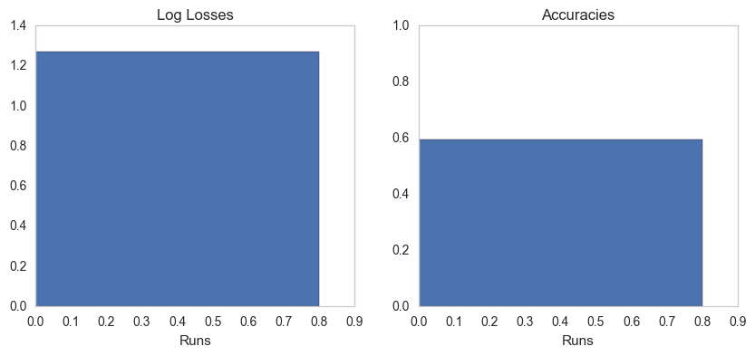


## Model 2 -  Multinomial Sag Logit


```python
from datetime import datetime as dt
from sklearn.linear_model import LogisticRegressionCV
from sklearn import metrics as mt
import multiprocessing
sns.set_style("darkgrid", {"axes.facecolor": ".9"})

# http://scikit-learn.org/stable/modules/generated/sklearn.linear_model.LogisticRegression.html#sklearn.linear_model.LogisticRegression

# sklearn.linear_model.LogisticRegressionCV(Cs=10, fit_intercept=True, cv=None, dual=False,
# penalty='l2', scoring=None, solver='lbfgs', tol=0.0001, max_iter=100, class_weight=None,
# n_jobs=1, verbose=0, refit=True, intercept_scaling=1.0, multi_class='ovr', random_state=None)

start = dt.now()

# l2 regulariazation only works with 'multinomial' and solvers: ‘sag’, and ‘lbfgs’
# using 10 fold cross validation

c = LogisticRegressionCV(Cs=10, fit_intercept=True, cv=skf, n_jobs=-1, penalty='l2',
                              solver='sag', tol=0.00001, class_weight=None,
                              verbose=0, refit=True, intercept_scaling=1.0, multi_class='multinomial')


print("Sag Solver..."),
print("Fitting Logit..."),
c.fit(trainer, y_train)

print("predicting...")
y_hat = c.predict(tester)

print 'Accuracy is', mt.accuracy_score(y_test,y_hat)*100, '%'

print multiprocessing.cpu_count(), 'CPUs Ran in', dt.now() - start, 'minutes'

conf = mt.confusion_matrix(y_test,y_hat)
plot_confusion_matrix(conf, [x for x in range(10)],
                          normalize=False,
                          title='Confusion matrix',
                          cmap=plt.cm.cool)

# prob = c.predict_proba(tester)
# print 'Probabilities', prob
# print 'maximum probability', np.max(prob)

```

    Sag Solver... Fitting Logit... predicting...
    Accuracy is 13.8428571429 %
    8 CPUs Ran in 0:01:50.145000 minutes
    Confusion matrix, without normalization
    [[1667    0   20  111   17  139   22   14   25    9]
     [   0    7    8    3  149  333  131 1240   22  465]
     [  79    1  142  624   78   66    2  481  267  345]
     [ 220    9  435   85  602   36  353  205  115  116]
     [  46   78  135  809   24  330  149    2  487   34]
     [ 217   20   87  117  145   95  742  245  119  114]
     [  60    3    0  306  104  908    9   83  286  248]
     [ 114  151 1229  262    4  159   85  129  101   16]
     [  29    5  412   75  207   27  274   60  740  154]
     [  42  163  820  353    7  134  393   10  191    9]]


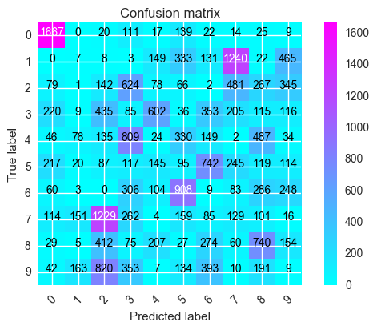


# Predictive Probablities were not noted, as we are more focused on confusion amongst classifications, and not the predictive power of any one of the classes.
The plot above shows high confusion with 1, 2 and 7, and is under predicting 5 and 9.  Class weights may improve accuracy

# Multinomial lbfgs logit


```python
from sklearn.linear_model import LogisticRegression, LogisticRegressionCV
import numpy as np
from sklearn import metrics as mt

# Will try lbfgs
start = dt.now()

# http://scikit-learn.org/stable/modules/generated/sklearn.linear_model.LogisticRegression.html#sklearn.linear_model.LogisticRegression

c = LogisticRegressionCV(solver='lbfgs', cv=skf, penalty='l2',
        multi_class='multinomial', tol=0.00001)


print("lbfgs Solver..."),
print("Fitting Logit..."),
c.fit(trainer, y_train)

print("predicting...")
y_hat = c.predict(tester)

print 'Accuracy', mt.accuracy_score(y_test,y_hat)*100, '%'

print 'CPU Time: ', dt.now() - start

conf = mt.confusion_matrix(y_test,y_hat)
plot_confusion_matrix(conf, [x for x in range(10)],
                          normalize=False,
                          title='Confusion matrix',
                          cmap=plt.cm.BuPu)

# prob = c.predict_proba(tester)
# print 'Probabilities', prob
# print 'maximum probability', np.max(prob)
```

    lbfgs Solver... Fitting Logit... predicting...
    Accuracy 13.8428571429 %
    CPU Time:  0:01:55.448000
    Confusion matrix, without normalization
    [[1667    0   20  111   17  139   22   14   25    9]
     [   0    7    8    3  149  333  131 1240   22  465]
     [  79    1  142  624   78   66    2  481  267  345]
     [ 220    9  435   85  603   36  353  204  115  116]
     [  46   79  135  809   24  330  149    2  486   34]
     [ 217   20   87  117  145   95  742  245  119  114]
     [  60    3    0  306  104  908    9   83  286  248]
     [ 114  151 1229  262    4  159   85  129  101   16]
     [  29    5  412   75  207   27  274   60  740  154]
     [  42  165  819  353    7  134  392   10  191    9]]


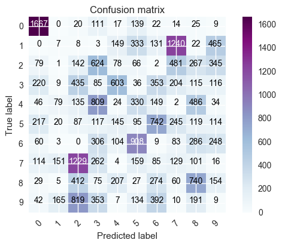


When the tests above were being performed it was realized that the data was possibly consistent of too many variables, as it took quite some time to perform the log regrssion and other features. With that it was determined that a PCA for dimension reduction would be of great use to this project.

The code below is pulled from a Kaggler, and provides functions for a PCA and logistic regression model that is over 90% accurate.

Now it is time to plot the weights to show where the numbers might lie in determination of which attributes are most important when predicting. As stated presviouly this data set is a little odd in determination of variable selection however we can see that the pixels in the middle of the data set, show to a much greater extent where the possible future values may lie.

<a id='support_vector_machine'></a>
<a href="#top">Back to Top</a>
# Support Vector Machines (SVM)


# Polynomial Kernel


```python
# Reuse X and y from PCA from above
from datetime import datetime as dt

from sklearn.svm import SVC
from sklearn import metrics as mt

# (C=1.0, kernel='rbf', degree=3, gamma='auto', coef0=0.0, shrinking=True, probability=False, tol=0.001, cache_size=200,
# class_weight=None, verbose=False, max_iter=-1, decision_function_shape=None, random_state=None)

# adding max_iter or balancing slows things down and hurts accuracy, so leave it at defaults, and


start = dt.now()
s = SVC(C=0.5, kernel='poly', degree=3, tol=0.00001)
print("Training SVM..."),
s.fit(trainer, y_train)                              # train using PCA data

print("Predicting...")
y_hat = s.predict(tester)                            # set the predictions for scoring

print 'Accuracy', mt.accuracy_score(y_test,y_hat)*100, '%'
time = dt.now() - start
print 'CPU Time: ', time


conf = mt.confusion_matrix(y_test,y_hat)           # Create Confusion matrix
# prob = c.predict_proba(tester)
# print 'Probabilities', prob   
# Compute confusion matrix
np.set_printoptions(precision=2)

# Plot non-normalized confusion matrix
conf = mt.confusion_matrix(y_test,y_hat)
plot_confusion_matrix(conf, [x for x in range(10)],
                          normalize=False,
                          title='Confusion matrix',
                          cmap=plt.cm.Greens)

# # Plot normalized confusion matrix
# plt.figure()
# plot_confusion_matrix(conf, classes=class_names, normalize=True,
#                       title='Normalized confusion matrix')

plt.show()

```

    Training SVM... Predicting...
    Accuracy 14.1 %
    CPU Time:  0:01:15.541000
    Confusion matrix, without normalization
    [[ 944    6   51  202  115  401   33   67   43  162]
     [   0  307    1   10  194  286    3  133   31 1393]
     [   3   24  104  588  164   71    1  346  273  511]
     [  36   60  258   79  685   50  125  155  153  575]
     [   7   30    8  998   38  285    4    2  583  139]
     [  54  107   31  120  461  159  293  102  229  345]
     [  30   14    0  493   60  762   10   25  306  307]
     [  23  394  715  554    5  176   10  124  202   47]
     [   3   11  103   59  323   27   64   33 1021  339]
     [  10  130  287  744   36  101   13    9  617  175]]


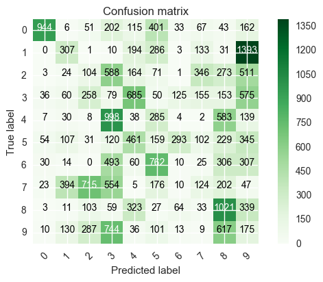


# The CM above shows confusion with 5-0 and underpredicting 5, 4-9, 1-9, and 7-9.  

These classes will have to be examined more closely, and potentially weighted if SVM is to be used.

<a id='linear_kernel'></a>
<a href="#top">Back to Top</a>
# Linear Kernel


```python
# Linear Kernel with tolerance upped by order of magnitude
from datetime import datetime as dt

from sklearn.svm import SVC
from sklearn import metrics as mt

start = dt.now()
weights1 = {0:.05,1:.15, 2:0.05, 3:0.125, 4:0.125, 5:0.1, 6:0.1, 7:0.15, 8:0.1, 9:0.05}
s = SVC(C=0.5, kernel='linear', tol=0.00001)
print("Training SVM..."),
s.fit(trainer, y_train)

print("Predicting...")
y_hat = s.predict(tester)

print 'Accuracy', mt.accuracy_score(y_test,y_hat)*100, '%'

print 'CPU Time: ', dt.now() - start

conf = mt.confusion_matrix(y_test,y_hat)
# prob = c.predict_proba(tester)
# print 'Probabilities', prob

conf = mt.confusion_matrix(y_test,y_hat)
plot_confusion_matrix(conf, [x for x in range(10)],
                          normalize=False,
                          title='Confusion matrix',
                          cmap=plt.cm.Oranges)

```

    Training SVM... Predicting...
    Accuracy 13.4761904762 %
    CPU Time:  0:00:22.263000
    Confusion matrix, without normalization
    [[1650    0   44   94   24  130   19   18    7   38]
     [   1  106    7   45  326  188   69  853   34  729]
     [  57    9  192  668   56   47    1  413  247  395]
     [ 260   13  599   88  602   33  251  221   69   40]
     [  80   99  124  792   24  333  168    6  453   15]
     [ 261   46  174   74  237   93  558  275   93   90]
     [ 104    8    2  391   98  910    6   68  183  237]
     [ 121  153 1289  226    3  152   58  112  125   11]
     [  36    7  498  117  319   44  223   64  556  119]
     [  60  254  632  391   10  123  367   28  254    3]]


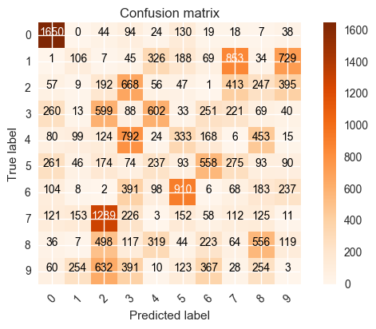


## The linear kernel shows underclassifying 9 and 5 with a confusion on 4-9.  Similar issues are being encountered with 9 and 4, with 9 now underpredicted.


<a id='rbf'></a>
<a href="#top">Back to Top</a>
# Radial Basis Function Kernel

<a id='sigmoid'></a>
<a href="#top">Back to Top</a>
# Sigmoid Kernel


```python
# sigmoid kernel
start = dt.now()
s = SVC(C=0.5, kernel='sigmoid', probability=True, tol=0.00001)
print("Training SVM..."),
s.fit(trainer, y_train)

print("Predicting...")
y_hat = s.predict(tester)
print 'Accuracy', mt.accuracy_score(y_test,y_hat)*100, '%'

print 'CPU Time: ', dt.now() - start

conf = mt.confusion_matrix(y_test,y_hat)
# prob = c.predict_proba(tester)
# print 'Probabilities', prob
conf = mt.confusion_matrix(y_test,y_hat)
plot_confusion_matrix(conf, [x for x in range(10)],
                      normalize=False,
                      title='Confusion matrix',
                      cmap=plt.cm.YlGn)
```

    Training SVM... Predicting...
    Accuracy 14.0761904762 %
    CPU Time:  0:02:04.139000
    Confusion matrix, without normalization
    [[1635    0   37  109   17  139   54   11    5   17]
     [   0  227   15    3  211  326  162  375   13 1026]
     [  47   23  172  612  114   75    4  530  254  254]
     [ 199   26  566   50  514   26  424  216   67   88]
     [  71  197  119  687   29  374  166    2  431   18]
     [ 232  121   92   41  321   86  604  213  113   78]
     [ 138    4    3  487   85  799   32   83  262  114]
     [ 155  259 1144  130    3  168  141  138  104    8]
     [  33   15  465   71  225   65  317   71  581  140]
     [  57  237  721  314    8  184  340   14  241    6]]


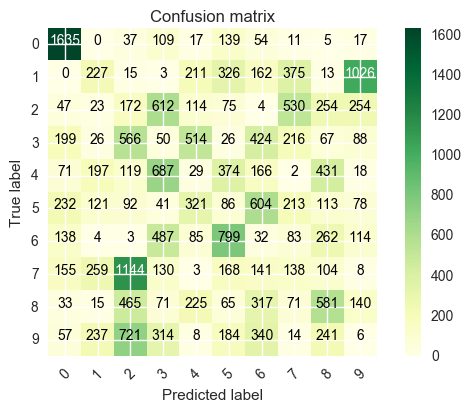


# SVM with the 'rbf' solver outperforms the linear and polynomial, and sigmoid as well as the logit due to its multidimensional flexibility, and since the digits are drawn with distances from the center of the image, radial distance is used for modeling.

Adjusting much of the tolerance and penalty parameters had little effect on the accuracies.

# Each of these SVM and Logit classifiers have very similar  accuracy, but are highly unstable due to PCA.  Though, without PCA, the original dimensionality of the image data is too high for these methods in the current implementation.  


```python
import numpy as np
import matplotlib.pyplot as plt
from sklearn import svm
from sklearn.linear_model.stochastic_gradient import SGDClassifier
#from sklearn.linear_model import SGDClassifier

# we create 1000 separable points
rng = np.random.RandomState(0)
n_samples_1 = 1000
n_samples_2 = 100
X = np.r_[1.5 * rng.randn(n_samples_1, 2),
          0.5 * rng.randn(n_samples_2, 2) + [2, 2]]
y = [0] * (n_samples_1) + [1] * (n_samples_2)

# fit the model and get the separating hyperplane
clf = SGDClassifier(n_iter=100, alpha=0.01)
clf.fit(X, y)

w = clf.coef_[0]
a = -w[0] / w[1]
xx = np.linspace(-5, 5)
yy = a * xx - clf.intercept_[0] / w[1]


# get the separating hyperplane using weighted classes
wclf = svm.SVC(kernel='linear', class_weight={1: 10})
wclf.fit(X, y)

ww = wclf.coef_[0]
wa = -ww[0] / ww[1]
wyy = wa * xx - wclf.intercept_[0] / ww[1]

# plot separating hyperplanes and samples
h0 = plt.plot(xx, yy, 'k-', label='no weights')
h1 = plt.plot(xx, wyy, 'k--', label='weights')
plt.scatter(X[:, 0], X[:, 1], c=y, cmap=plt.cm.Paired)
plt.legend()

plt.axis('tight')
plt.show()
```


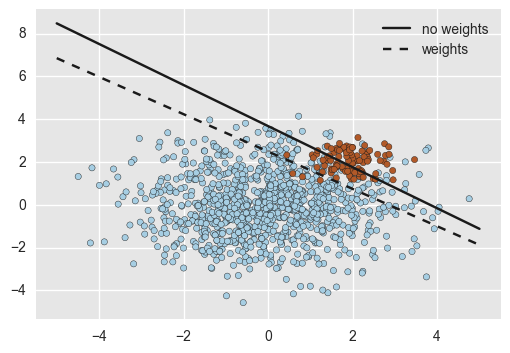


# The code above plots the coefficients of a Stochastic Gradient Decent Classifier, showing the value of using class weights versus not using weights.

This information may be used to revisit SVM with weighted classes in the future.

# Random Forest Benchmark

The code below is used as a starting point for future implementations of neural nets.  Currently, our team does not possess a Linux machine with a GPU card.  Once acquired, packages lasagne, and tensorflow will be used to train a highly accurate model able of achieving over 99%.


```python
#Code adapted from https://www.kaggle.com/c/digit-recognizer/forums/t/2299/getting-started-python-sample-code-random-forest

from sklearn.ensemble import RandomForestClassifier
import numpy as np
import pandas as pd

# create the training & test sets, skipping the header row with [1:]
       #  Sets testing object as a DataFrame
dataset = pd.read_csv("https://dl.dropboxusercontent.com/s/xb2xkaiwxelx55g/train.csv?raw=1")
target = dataset[[0]].values.ravel()
train = dataset.iloc[:,1:].values
test = pd.read_csv("https://dl.dropboxusercontent.com/s/rhxn9alnnexqa75/test.csv?raw=1")       

# create and train the random forest
# multi-core CPUs can use: rf = RandomForestClassifier(n_estimators=100, n_jobs=2)
rf = RandomForestClassifier(n_estimators=100, n_jobs=2)
print("Fitting...")
rf.fit(train, target)
pred = rf.predict(test)

np.savetxt('data/submission_rand_forest.csv', np.c_[range(1,len(test)+1),pred],
           delimiter=',', header = 'ImageId,Label', comments = '', fmt='%d')

print 'CPU Time: ', dt.now() - start
print("Benchmark Created!")
```

# Reloading Data


```python

import pandas as pd
import numpy as np
from sklearn.model_selection import train_test_split  # We will try the method train_test_split instead of ShuffleSplit

print("Importing...")
# create data frame of training and testing sets
trains = pd.read_csv("https://dl.dropboxusercontent.com/s/xb2xkaiwxelx55g/train.csv?raw=1")
y = trains[[0]].values.ravel()
X = trains.iloc[:,1:].values

print("splitting...")
X_train, X_test, y_train, y_test = train_test_split(X, y, test_size=0.5)  # create x and y training set

print("Done!")

from sklearn.decomposition import PCA

print("Fitting PCA...")
n_comp = 50
pca = PCA(n_components=n_comp, whiten=True, svd_solver='arpack')

# Set fitted PCA object
trainer = pca.fit_transform(X_train)
tester = pca.fit_transform(X_test)
print("Done!")
```

    Importing...
    splitting...
    Done!
    Fitting PCA...
    Done!


<a id='random_forest'></a>
<a href="#top">Back to Top</a>
# Random Forest


```python
from sklearn.ensemble import RandomForestClassifier
from sklearn.model_selection import train_test_split
from sklearn import metrics as mt
from datetime import datetime as dt

start=dt.now()
rf = RandomForestClassifier(n_estimators=100, n_jobs=2)  # 100 estimators has seen the most success
print("Fitting...")
%time rf.fit(X_train, y_train)

y_hat = rf.predict(X_test)
conf = mt.confusion_matrix(y_test,y_hat)
print 'Accuracy', mt.accuracy_score(y_test,y_hat)*100, '%'
plot_confusion_matrix(conf, [x for x in range(10)],
                  normalize=False,
                  title='Confusion matrix',
                  cmap=plt.cm.RdPu)
```

    Fitting...
    Wall time: 13.6 s
    Accuracy 95.5238095238 %
    Confusion matrix, without normalization
    [[2013    0    1    1    1    4   10    1   12    1]
     [   0 2337   13   10    2    2    5    5    2    0]
     [  11    4 1972    4   23    1    9   22   10    6]
     [   5    6   37 2063    4   38    3   17   31   12]
     [   1    6    1    1 1931    0    8    5    4   44]
     [   9    5    3   38    8 1816   15    1   19   11]
     [  13    3    4    0   11   13 2049    0    4    0]
     [   4   13   29    2   18    0    0 2061    7   39]
     [   3   15   13   30   11   28    9    3 1867   26]
     [  17    6    6   30   39    7    1   24   20 1951]]


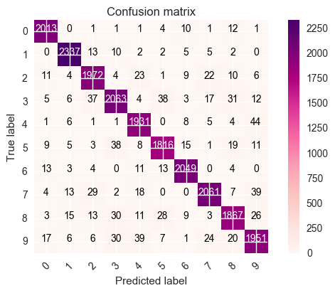


# By popular demand, the random forest is the best performer with ~96% accuracy and very little training time.

Decision trees are the most powerful models for this data because they are the best classifiers.  Random forest is the best among the D trees because it controls overfitting and uses bootstrap averaging to improve its accuracy.  The Convolutional Neural Net: https://www.kaggle.com/kobakhit/digit-recognizer/digit-recognizer-in-python-using-cnn, and tensorflow: https://www.kaggle.com/kakauandme/digit-recognizer/tensorflow-deep-nnwill use this benchmark to achieve 98 and 99% accuracy.  We will build on the work of these other Kagglers to improve on their accuracies by adjusting parameters and performing some preprocessing in future installments of the MNIST handwritten digits exploration.

<a id='ball_tree'></a>
<a href="#top">Back to Top</a>
# Ball Tree


```python
from sklearn.neighbors import KNeighborsClassifier
start = dt.now()

knn = KNeighborsClassifier(n_neighbors=5, algorithm='ball_tree', p=2, n_jobs=-1)  # default is n_neighbors=5, stick with it for training
print 'Fitting', 'ball_tree'
knn.fit(X_train, y_train)
y_hat = knn.predict(X_test)
print 'ball_tree accuracy:', mt.accuracy_score(y_hat,y_test)
print 'CPU Time: ', dt.now() - start

```

    Fitting ball_tree
    ball_tree accuracy: 0.959857142857
    CPU Time:  0:03:19.004000


```python
conf1 = mt.confusion_matrix(y_test,y_hat)
plot_confusion_matrix(conf1, [x for x in range(10)],
                  normalize=False,
                  title='Confusion matrix',
                  cmap=plt.cm.PuRd)
```

    Confusion matrix, without normalization
    [[2026    0    2    0    0    3   10    2    0    1]
     [   0 2366    2    1    1    1    2    3    0    0]
     [  18   25 1962    6    3    1    3   42    1    1]
     [   3    9   16 2120    3   29    2   16   11    7]
     [   1   25    0    0 1908    0    5    4    0   58]
     [   8    8    0   37    3 1832   22    3    2   10]
     [   7    1    0    0    2    8 2076    0    3    0]
     [   2   39    6    1   16    0    0 2075    0   34]
     [  11   33   13   44   10   48    8    6 1807   25]
     [  12   11    1   19   28    2    0   37    6 1985]]


<a id='kd_tree'></a>
<a href="#top">Back to Top</a>
# KD Tree


```python
from sklearn.neighbors import KNeighborsClassifier
start = dt.now()
knn = KNeighborsClassifier(n_neighbors=5, algorithm='kd_tree', n_jobs=-1)  # p=2 euclidean vs p=1 manhattan
print 'Fitting kd_tree'                                                         # n_neighbors=5 by default, doubling improved accuracy
%time knn.fit(X_train, y_train)
y_hat = knn.predict(X_test)
print 'kdtree accuracy:', mt.accuracy_score(y_hat,y_test)
print 'CPU Time: ', dt.now() - start


```

    Fitting kd_tree
    Wall time: 4.21 s
    kdtree accuracy: 0.959857142857
    CPU Time:  0:05:03.156000


```python
conf2 = mt.confusion_matrix(y_test,y_hat)
plot_confusion_matrix(conf2, [x for x in range(10)],
                  normalize=False,
                  title='Confusion matrix',
                  cmap=plt.cm.BuGn)
```

    Confusion matrix, without normalization
    [[2026    0    2    0    0    3   10    2    0    1]
     [   0 2366    2    1    1    1    2    3    0    0]
     [  18   25 1962    6    3    1    3   42    1    1]
     [   3    9   16 2120    3   29    2   16   11    7]
     [   1   25    0    0 1908    0    5    4    0   58]
     [   8    8    0   37    3 1832   22    3    2   10]
     [   7    1    0    0    2    8 2076    0    3    0]
     [   2   39    6    1   16    0    0 2075    0   34]
     [  11   33   13   44   10   48    8    6 1807   25]
     [  12   11    1   19   28    2    0   37    6 1985]]


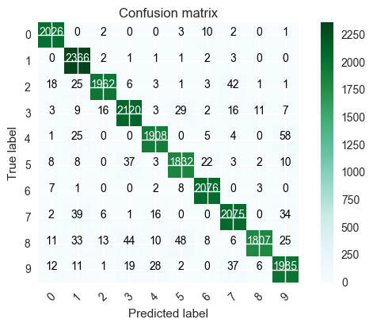


# The KD Tree outperformed the Ball tree due to its multdimensional space partitioning scheme. Although, they did come to similar accuracies around 96%, the ball tree was significantly quicker.

This image data is highly dimensional, so the splitting hyperplane that the ball uses more clearly separates the classes of images in the nested hypersphere of the ball.

<a id='deployment'></a>
<a href="#top">Back to Top</a>
# Deploy

 Deploying a more accurate model for digit recognization will become more important as the use of handwriting declines, the shape and appearance of digits in the wild could become highly variable.  By training more versatile models, more and more interpretations can be indexed, improving the accuracy of computer vision for digitizing everything from cashier's checks, to post-it notes.

# Conclusion

By training a highly accurate model using random forest combined with a convolutional neural net, or a tensorflow neural net will result in highly accurate models with accuracy of predicting the test set over 99%.  We will pursue these methods, as soon as the technology is acquired.  

The goal is ~100% accuracy in predicting a handwritten digit.  Without this level of accuracy, technology like cashing a check on your smart phone would not be possible.  As training times will likely converge, any small improvements in accuracy of a model can come at high training cost.
