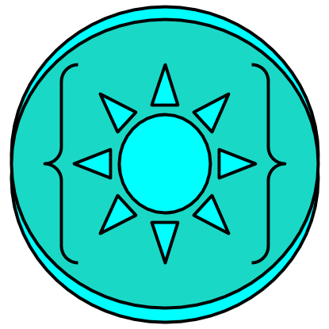

# Last night I drew an SVG icon
## It was easy and Free.

  <table>
    <caption align="bottom">My new icon — made with Google Drawings</caption>
  </table>

I made this icon using <a href="https://docs.google.com/drawings/"><i class="fa fa-google"></i>oogle Drawings</a> one night at 3:00 am looking for some cool content for my site. It is damn near impossible to get a good free drawing program in a browser; or design anything really cool without Adobe software. I hope with web browser advancements everyone in the world will have access to all the creative tools they need for free in the future

The creativity required to produce anything cool with Google Drawings is actually substantially nothing at all. Just create some shapes, and play with a few parameters and you’ve got something unique on your hands that can be downloaded as an SVG drawing or standard JPG/PNG.

This strange, eyeball-like design was conceived shortly after returning from a surreal music experience with <a href="https://soundcloud.com/random-rab"><i class="fa fa-soundcloud"></i> Random Rab</a> and <a href="https://soundcloud.com/desertdwellers"><i class="fa fa-soundcloud"></i> Desert Dwellers</a>, whose Spotify radio station chose the following:

<iframe src="https://open.spotify.com/embed/track/2PWfIEN2U4DdN5V4CnQ78N" width="300" height="380" frameborder="0" allowtransparency="true"></iframe>

<i>Down Rooted HipHop Track from MC Yogi</i>

Check out the live video of <a href="https://soundcloud.com/random-rab"><i class="fa fa-soundcloud"></i> Random Rab</a> below:

<iframe width="560" height="315" src="https://www.youtube.com/embed/AOgXnX8zeAQ" frameborder="0" gesture="media" allow="encrypted-media" allowfullscreen></iframe>
